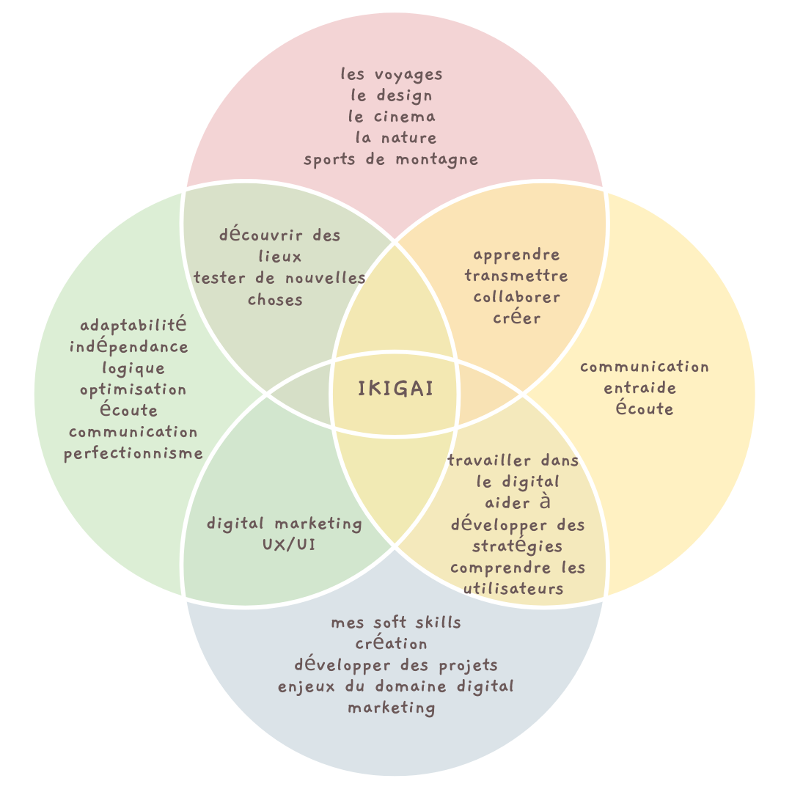
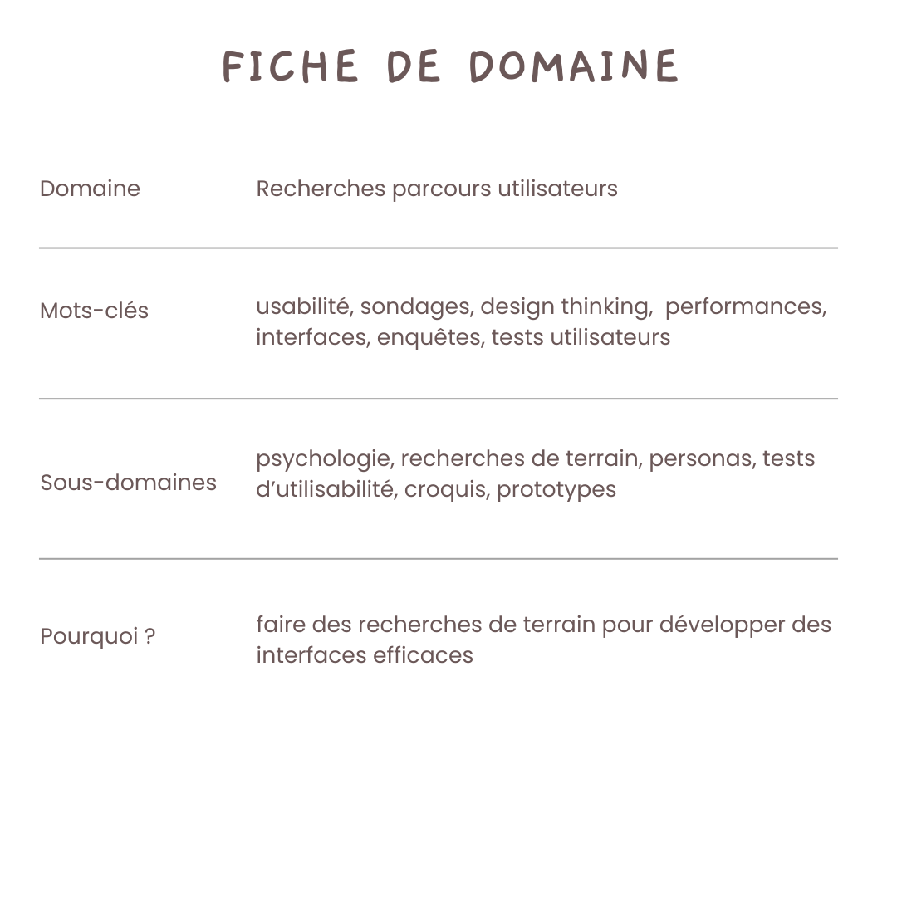

+++
title = "A Propos"
description = "Informations sur mon domaine de prédilection"
date = "2023-01-27"
aliases = ["about-us", "about-hugo", "contact"]
author = "Hugo Authors"
+++

Je m'appelle Julie Resch et je suis étudiante en 3ème année d'Ingénierie des Médias à la HEIG-VD de Yerdon-les-bains.

Ma formation est pluridisciplinaire et me permet d’avoir des compétences dans de nombreux domaines : 

* Marketing digital 
* Programmation
* Parcours utilisateurs 
* Conception graphique 
* Analyse de données 
* Gestion de projet
* …

J’ai forcément des intérêts plus fort pour certaines disciples et je suis notamment très intéressée par tout ce qui touche aux analyses de parcours utilisateurs et leur optimisation. 

Je vous laisse découvrir mon Ikigai : 

Et voici la fiche de mon domaine de compétances :

Je vous laisse découvrir mes articles sur le site web. 